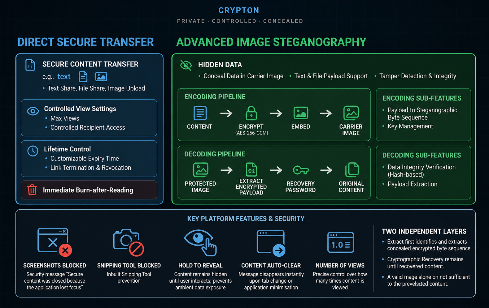
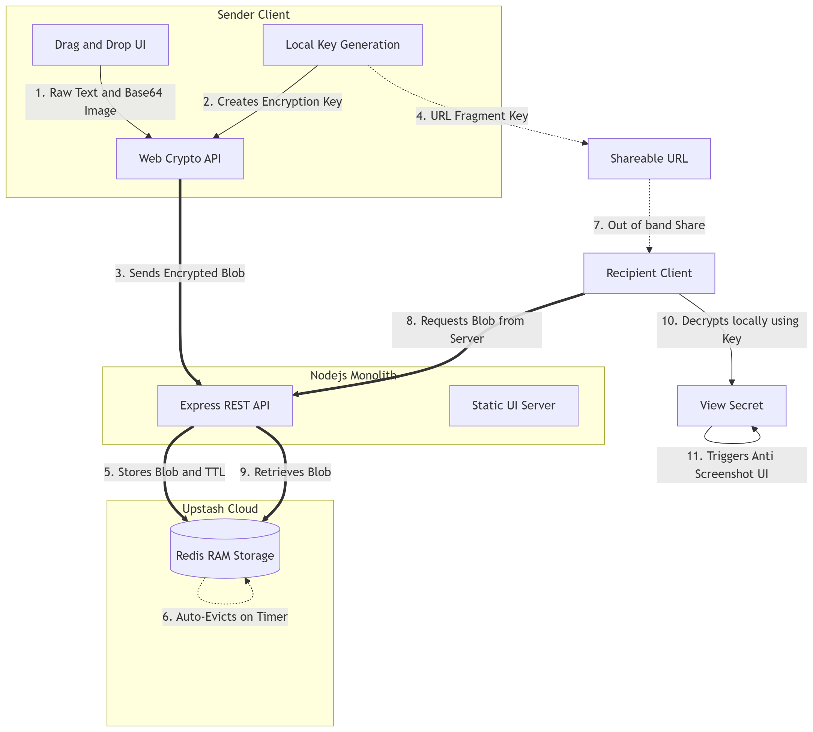

# 🔐 Crypton

### Secure, controlled and temporary sharing of sensitive information

Crypton is a privacy-focused secure sharing platform for sharing sensitive text, files, and images without treating them as permanent data.

The project combines **client-side AES-256-GCM encryption, temporary Redis storage, expiration, view limits, burn-after-reading, controlled viewing, deletion, and image steganography** into one workflow.

**Live Demo:**
https://crypton-omega-olive.vercel.app/

## 🔎 Platform Overview


---

## 📌 Table of Contents

* [Problem](#-problem)
* [Solution](#-solution)
* [Key Features](#-key-features)
* [Security Architecture](#-security-architecture)
* [Encryption](#-encryption)
* [Split-Key Design](#-split-key-design)
* [Ephemeral Storage](#-ephemeral-storage)
* [Image Steganography](#-image-steganography)
* [Controlled Viewing](#-controlled-viewing)
* [System Flow](#-system-flow)
* [Technology Stack](#-technology-stack)
* [Project Structure](#-project-structure)
* [Running Locally](#-running-locally)
* [Production Build](#-production-build)
* [Security Considerations](#-security-considerations)
* [Innovation](#-innovation)
* [Judging Rubric](#-judging-rubric)
* [Limitations](#-limitations)
* [Future Improvements](#-future-improvements)
* [Reference](#-reference)

---

# 🧩 Problem

Sensitive information is often shared through platforms that are designed to keep information available.

Examples include:

* API keys
* Passwords
* Server credentials
* Configuration values
* Temporary access information
* Private notes
* Error logs
* Sensitive screenshots
* Files and images

Once this information is shared through normal messaging, email, or cloud storage, copies may remain in message histories, databases, backups, synced devices, or other locations.

For information that only needs to be viewed temporarily, this creates unnecessary exposure.

### The problem we wanted to solve

> **How can sensitive information be shared securely while giving the sender control over how long it remains accessible?**

---

# 💡 Solution

Crypton treats sensitive information as a **temporary resource** rather than a permanent message.

The content is encrypted on the client side before the encrypted payload is sent to the backend.

The sender can then control its lifecycle using:

* Expiration time
* Maximum views
* Burn-after-reading
* Manual deletion
* Optional password protection
* Controlled reveal
* Screenshot/snipping mitigation

Crypton also adds an additional concealment option through **image steganography**, where encrypted data can be embedded inside a carrier image.

---

# ✨ Key Features

## 🔒 Client-Side AES-256-GCM Encryption

Sensitive content is encrypted in the browser using the native **Web Crypto API**.

Crypton uses:

* AES-256-GCM for authenticated encryption
* PBKDF2 for password/key derivation where applicable
* Browser-native cryptographic APIs

The backend receives the encrypted payload rather than the original plaintext content.

---

## 🗝️ Split-Key URL Design

Crypton separates the encrypted payload from the client-side key material.

The key can be placed in the URL fragment:

```text
https://crypton.example/share/<id>#<key>
```

The fragment portion of a URL is handled by the browser and is not included in the normal HTTP request.

This allows the encrypted payload and key material to be separated between the server and client.

---

## 🔑 Optional Password Protection

A user can add an additional password when creating a secure transfer.

The password can be shared separately from the Crypton link.

For example:

```text
Crypton Link → Email
Password    → Separate channel
```

This provides an additional protection layer if the link itself is exposed.

---

## 🔥 Burn After Reading

Crypton supports one-time access.

When burn-after-reading is enabled, the secret is configured with a single allowed view and is removed after that successful access.

This is useful for:

* One-time credentials
* Temporary passwords
* API keys
* Sensitive notes
* Private information

---

## ⏱️ Automatic Expiration

Each stored payload can have a TTL.

Redis handles the expiration automatically, so a secret does not need to remain available indefinitely.

If no custom TTL is supplied, the current implementation uses a default expiration period.

---

## 👁️ Maximum View Limits

The sender can define how many successful views are allowed.

Examples:

```text
Maximum views: 1
```

or:

```text
Maximum views: 5
```

Once the allowed number of views is reached, the payload is removed.

---

## 🗑️ Remote Deletion

Every created secret receives a deletion token.

The sender can use that token to delete the stored payload before its normal expiration.

This is useful when:

* A link was shared with the wrong person
* The information is no longer required
* A credential has been rotated
* Access needs to be revoked immediately

---

## 🖼️ Text, Files and Images

Crypton supports secure sharing of sensitive content including text and supported file/image payloads.

The goal is to keep the sharing workflow simple while applying the same temporary-access principles to different types of information.

---

# 🖼️ Image Steganography

Crypton's steganography feature provides an additional concealment layer.

Instead of exposing an encrypted payload directly, encrypted information can be embedded into a carrier image.

### Encoding

```text
Original Content
       ↓
Client-Side Encryption
       ↓
Encrypted Payload
       ↓
Steganographic Embedding
       ↓
Carrier Image
```

### Decoding

```text
Protected Image
       ↓
Extract Embedded Payload
       ↓
Recover Encrypted Data
       ↓
Recover Key / Password
       ↓
Integrity Verification
       ↓
Original Content
```

The important distinction is:

> **Encryption protects the information. Steganography conceals the presence of the protected information.**

---

# 🛡️ Controlled Viewing

Crypton includes additional controls designed to reduce accidental exposure while sensitive content is being viewed.

### Hold to Reveal

Sensitive content can remain hidden until the recipient actively interacts with the reveal control.

### Copy Restrictions

Text selection and copying can be restricted while protected content is displayed.

### Focus-Loss Protection

The application can hide protected content when the browser loses focus.

### Screenshot / Snipping Mitigation

Crypton includes client-side measures intended to react to screenshot and screen-snipping activity.

These features are intended as **exposure-mitigation controls**, not as an absolute guarantee against screen capture.

A user can always photograph a screen with another device, so this limitation is part of the threat model.

---

# 🏗️ Security Architecture

Crypton's security model is based on keeping encryption on the client side and keeping server-side storage temporary.

```text
                         SENDER
                           │
                           ▼
                   Sensitive Content
                           │
                           ▼
                Client-Side Encryption
                           │
                           ▼
                     AES-256-GCM
                           │
                           ▼
                  Encrypted Payload
                           │
                           ▼
                    Redis Storage
                           │
                    ┌──────┴──────┐
                    │             │
                 TTL Expiry   View Control
                    │             │
                    └──────┬──────┘
                           │
                           ▼
                     Shared Link
                           │
                           ▼
                       RECIPIENT
                           │
                           ▼
                 Retrieve Ciphertext
                           │
                           ▼
             Key / Password Recovery
                           │
                           ▼
                 Client-Side Decryption
                           │
                           ▼
                   Original Content
                           │
                           ▼
                 Burn / Delete / Expire
```

---

# 🔐 Encryption

Crypton uses the browser's native Web Crypto API rather than implementing the underlying encryption algorithm itself.

### AES-256-GCM

AES-GCM provides authenticated encryption, giving the system both:

* Confidentiality
* Integrity protection

### PBKDF2

PBKDF2 is used where password/key derivation is required.

The derivation process increases the computational cost of password guessing compared with using a password directly as an encryption key.

### Why Web Crypto API?

Using the browser's native cryptographic API allows Crypton to rely on established platform cryptographic primitives rather than implementing AES itself.

---

# 🗝️ Split-Key Design

The encrypted payload stored by the backend and the client-side key material are intentionally separated.

Conceptually:

```text
SERVER
└── Encrypted Payload
    ├── Ciphertext
    ├── IV
    └── Salt

CLIENT
└── Key Material
```

The URL fragment can carry the client-side key material because URL fragments are not sent as part of the normal HTTP request.

The encrypted payload therefore remains separate from the fragment during server communication.

---

# ⚡ Ephemeral Storage

Crypton uses Redis for temporary payload storage.

The backend stores information such as:

* Encrypted ciphertext
* IV
* Salt
* Expiration information
* View information
* Burn-after-reading state
* Deletion token

Redis TTL is applied when the payload is created.

The lifecycle is:

```text
CREATE
   ↓
ENCRYPT
   ↓
STORE
   ↓
SHARE
   ↓
VIEW
   ↓
DELETE / BURN / EXPIRE
```

The application is therefore designed around **temporary storage rather than permanent secret records**.

---

# 🔄 System Flow

## Sender

```text
1. Open Crypton
        ↓
2. Enter or upload content
        ↓
3. Configure expiration / views / security options
        ↓
4. Encrypt content in the browser
        ↓
5. Send encrypted payload to backend
        ↓
6. Store temporary payload in Redis
        ↓
7. Generate sharing link
        ↓
8. Share with recipient
```

## Recipient

```text
1. Open Crypton link
        ↓
2. Retrieve encrypted payload
        ↓
3. Recover client-side key material
        ↓
4. Enter password if required
        ↓
5. Decrypt locally
        ↓
6. Reveal protected content
        ↓
7. Consume the configured view
        ↓
8. Payload is deleted when its lifecycle ends
```

---

## 🖼️ System Architecture

The existing architecture diagram is retained below:



---

# 💻 Technology Stack

| Layer               | Technology        |
| ------------------- | ----------------- |
| Frontend            | React 19          |
| Build Tool          | Vite              |
| Backend             | Node.js + Express |
| Cryptography        | Web Crypto API    |
| Encryption          | AES-256-GCM       |
| Key Derivation      | PBKDF2            |
| Storage             | Redis             |
| Cloud Redis         | Upstash Redis     |
| Security Middleware | Helmet            |
| API                 | REST              |
| Deployment          | Vercel            |

---

# 📁 Project Structure

```text
Crypton/
│
├── api/
│   ├── paste/
│   │   ├── [id]/
│   │   └── index.js
│   └── _redis.js
│
├── public/
│
├── src/
│   └── frontend source files
│
├── architecture.png
├── crypton-overview.png
├── securebin_flow.png
│
├── server.js
├── index.html
├── package.json
├── package-lock.json
├── vite.config.js
└── README.md
```

The repository uses the `Crypton` directory as the application project, with the root repository containing the project folder and documentation.

---

# ⚙️ Running Locally

## Requirements

Install:

* Node.js
* npm
* Redis
* Git

For local development, Redis should be available at:

```text
redis://127.0.0.1:6379
```

The Vite development configuration proxies `/api` requests to the local backend on port `3000`.

---

## 1. Clone the Repository

```bash
git clone https://github.com/shraddha-sugathan/Crypton.git
cd Crypton/Crypton
```

---

## 2. Install Dependencies

```bash
npm install
```

---

## 3. Start Redis

Make sure Redis is running locally on port `6379`.

For example:

```bash
redis-server
```

If Redis is already installed as a system service, simply make sure the service is running.

---

## 4. Start the Backend

Open a terminal inside:

```text
Crypton/Crypton
```

Run:

```bash
node server.js
```

The backend runs on:

```text
http://localhost:3000
```

---

## 5. Start the Frontend

Open a second terminal:

```bash
cd Crypton/Crypton
npm run dev
```

Vite will start the development server.

Open the local HTTPS URL shown in the terminal, normally:

```text
https://localhost:5173
```

Because the project uses Vite's basic SSL plugin, the development server uses HTTPS.

---

## 6. Build for Production

To create a production build:

```bash
npm run build
```

To preview the production build locally:

```bash
npm run preview
```

---

# 🔧 Environment Variables

For the serverless API implementation, Redis can be configured using:

```env
REDIS_URL=your_redis_connection_string
```

If `REDIS_URL` is not provided, the local API Redis helper falls back to:

```text
redis://127.0.0.1:6379
```

Never commit production Redis credentials or other secrets to GitHub.

---

# ☁️ Deployment

The current application is deployed online and available through the live demo.

**Production Demo:**
[Crypton Live Demo](https://crypton-omega-olive.vercel.app/?utm_source=chatgpt.com)

For a Vercel deployment, the application project is located inside the `Crypton` directory.

Production Redis credentials should be configured through environment variables rather than committed to the repository.

---

# 🧪 Testing Checklist

Before demonstrating the project, verify the following:

* [ ] Create a text secret
* [ ] Open a generated secret link
* [ ] Verify client-side decryption
* [ ] Test expiration
* [ ] Test maximum view limits
* [ ] Test burn-after-reading
* [ ] Test remote deletion
* [ ] Test optional password protection
* [ ] Test file/image sharing
* [ ] Test image steganography encoding
* [ ] Test steganography extraction
* [ ] Test incorrect password handling
* [ ] Test modified/corrupted payload handling
* [ ] Test hold-to-reveal
* [ ] Test focus-loss protection
* [ ] Test screenshot/snipping mitigation

---

# 💡 Innovation

Crypton takes the basic secure-sharing problem and extends it in several directions.

### 1. Temporary by Design

Secrets are created with a controlled lifecycle instead of being treated as permanent messages.

### 2. Multiple Access Controls

The sender can combine:

* Expiration
* View limits
* Burn-after-reading
* Password protection
* Manual deletion

### 3. Image Steganography

Encrypted data can be concealed inside a carrier image, adding a second layer beyond encryption.

### 4. Controlled Viewing

The application includes hold-to-reveal, copy restrictions, focus-loss handling, and screen-capture mitigation.

### 5. Minimal Account Friction

The core sharing flow does not require users to create a traditional account before sending a secret.

### 6. Client-Side Cryptography

Encryption takes place in the browser before the protected payload is sent to the storage backend.

---

# 🆚 PrivateBin Reference

PrivateBin was used as a reference implementation to understand the underlying problem of secure, temporary information sharing.

Crypton is an independent implementation with its own:

* Architecture
* User interface
* Security controls
* Storage lifecycle
* Steganography workflow
* Viewing controls
* User experience

The goal was to preserve the **purpose of secure temporary sharing** while exploring a different implementation and additional functionality.

Reference:

[PrivateBin GitHub Repository](https://github.com/PrivateBin/PrivateBin?utm_source=chatgpt.com)

---

# 🏆 Judging Rubric Alignment

## 1. Problem Understanding 

Crypton addresses the problem of sensitive information being unnecessarily retained in conventional communication platforms.

The platform focuses on:

* Temporary sharing
* Controlled access
* Data minimization
* Expiration
* Secure transmission

---

## 2. Innovation & Differentiation 

Crypton's main differentiating features include:

* Image steganography
* Split-key URL design
* Burn-after-reading
* Maximum view limits
* Remote deletion
* Optional password protection
* Hold-to-reveal
* Screen-capture mitigation
* Ephemeral Redis storage

The project is independently implemented rather than reproducing PrivateBin's interface or implementation.

---

## 3. Technical Implementation & Architecture 

The project combines:

* React
* Vite
* Node.js
* Express
* Redis
* Web Crypto API
* AES-256-GCM
* PBKDF2
* REST APIs
* Steganographic encoding

The architecture separates client-side encryption from temporary backend storage.

---

## 4. User Experience & Accessibility 

Crypton presents security controls through familiar user actions:

* Set expiration
* Set number of views
* Add a password
* Reveal content
* Delete a secret
* Share a link

The workflow is designed to minimize unnecessary steps while keeping the important security controls visible.

---

## 5. Performance, Reliability & Demo Quality 

Crypton uses lightweight web technologies and Redis for temporary data access.

The application is deployed and available through the live demo.

The production workflow also separates the frontend experience from the temporary storage layer.

---

## 6. Documentation & Explanation 

This README documents:

* The problem
* The solution
* Core functionality
* Security architecture
* Encryption
* Key separation
* Redis storage
* Steganography
* System flow
* Technology stack
* Local setup
* Testing
* Innovation
* Limitations
* Future improvements

---

# ⚠️ Security Considerations & Limitations

Crypton is designed to reduce the persistence and exposure of sensitive information, but browser-based security controls cannot eliminate every possible attack.

Important limitations include:

* A recipient can photograph a decrypted secret using another device.
* Screenshot and snipping protections cannot guarantee prevention of every capture technique.
* A compromised recipient device can expose content after decryption.
* Password protection depends partly on the strength and secrecy of the password.
* The security of the client-side application depends on the integrity of the browser and deployed application.
* Steganography is a concealment mechanism and does not replace encryption.
* Temporary storage does not protect content after it has already been decrypted and displayed to a recipient.

These limitations are considered part of Crypton's threat model.

---

# 🔮 Future Improvements

Potential improvements include:

* WebAuthn-based authentication
* Hardware-backed key protection
* Security auditing and penetration testing
* Automated security regression testing
* More granular recipient permissions
* Improved steganographic capacity
* Additional file-format support
* Stronger device-level protections
* Enterprise deployment options
* More advanced access policies

---

# 📚 Reference

### PrivateBin

[PrivateBin GitHub Repository](https://github.com/PrivateBin/PrivateBin?utm_source=chatgpt.com)

PrivateBin was used to understand the secure-sharing problem and reference existing approaches.

Crypton is an independently implemented solution with a different interface, architecture, feature set, and user experience.

---

# 🔐 Crypton

**Encrypt → Share → Control → Reveal → Expire**
